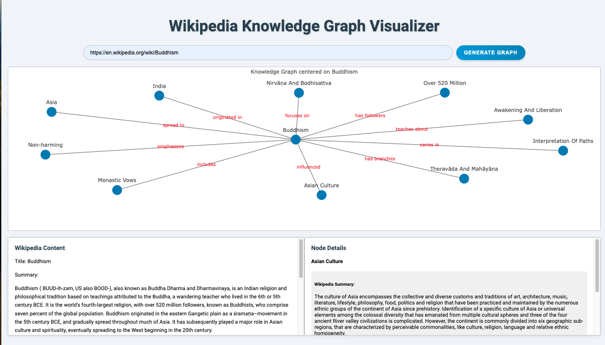

# Wikipedia Knowledge Graph Visualizer

[Live Demo](https://drive.google.com/file/d/1M3nChuF5qrNbZK7qEtQysJ79eJJQ6fZ6/view?usp=drive_link)

## 🌟 Overview

The Wikipedia Knowledge Graph Visualizer is an interactive web application that transforms Wikipedia articles into visually stunning and informative knowledge graphs. By leveraging the power of natural language processing and graph theory, this tool offers a unique way to explore and understand complex topics.

## 🚀 Features

- **Dynamic Graph Generation**: Convert any Wikipedia article into an interactive knowledge graph with just a URL.
- **AI-Powered Relationship Extraction**: Utilizes OpenAI's GPT-3.5 to identify key entities and their relationships from Wikipedia content.
- **Interactive Visualization**: Explore the knowledge graph with an intuitive, force-directed layout.
- **Node Details**: Click on any node to view detailed information, including a Wikipedia summary and related entities.
- **Expandable Exploration**: Generate new graphs from any node, allowing for continuous discovery.

## 🛠️ Installation

1. Clone the repository:

git clone https://github.com/jonathan-zlatin/wikipedia-knowledge-graph-visualizer.git

cd wikipedia-knowledge-graph-visualizer

2. Create a virtual environment (optional but recommended):

python -m venv venv
source venv/bin/activate  # On Windows, use venv\Scripts\activate

3. Install the required packages:

pip install -r requirements.txt

4. Set up your OpenAI API key:
- Create a `.env` file in the project root
- Add your API key: `OPENAI_API_KEY=your_api_key_here`

## 🖥️ Usage

1. Start the application:

python app.py

2. Open your web browser and go to `http://127.0.0.1:8050/`

3. Enter a Wikipedia URL in the input field and click "Generate"

4. Explore the generated knowledge graph:
- Hover over nodes to see entity names
- Click on nodes to view detailed information
- Use the "Generate Node Graph" button to explore related topics

## 🧠 How It Works

1. **Content Extraction**: The app fetches the content of the provided Wikipedia URL.
2. **Entity and Relationship Extraction**: OpenAI's GPT-3.5 model analyzes the content to identify key entities and their relationships.
3. **Graph Construction**: A NetworkX graph is built based on the extracted information.
4. **Visualization**: The graph is rendered using Plotly, creating an interactive visualization.
5. **User Interaction**: Dash handles user interactions, updating the display dynamically.

## 🛣️ Roadmap (ordered by importance)
Here's the list of roadmap items ordered by importance, starting with the most important:

1. [ ] Design a metric to evaluate the 'Essence-ness' of the nodes selected by the model
2. [ ] Add a multi-directional option to show connections between multiple nodes
3. [ ] Improve UX by making the graph more dynamic with pictures and different node styles based on entity type
4. [ ] Add more options for the graph to cater to different contexts such as history, economy, etc.
5. [ ] Implement user accounts for saving and sharing graphs
6. [ ] Integrate with other knowledge bases beyond Wikipedia
7. [ ] Add a 'helpful' button to the nodes; clicking it will save the relationship for future learning to enhance user-specific performance
8. [ ] Develop an API for programmatic access to the graph generation
9. [ ] Add support for multiple languages
10. [ ] Create a mobile app version

## 🙏 Acknowledgements

- OpenAI for their powerful GPT-3.5 model
- The Dash and Plotly teams for their excellent visualization tools
- The Wikipedia community for providing a wealth of knowledge

Created with 🧠 by Jonathan Zlatin
